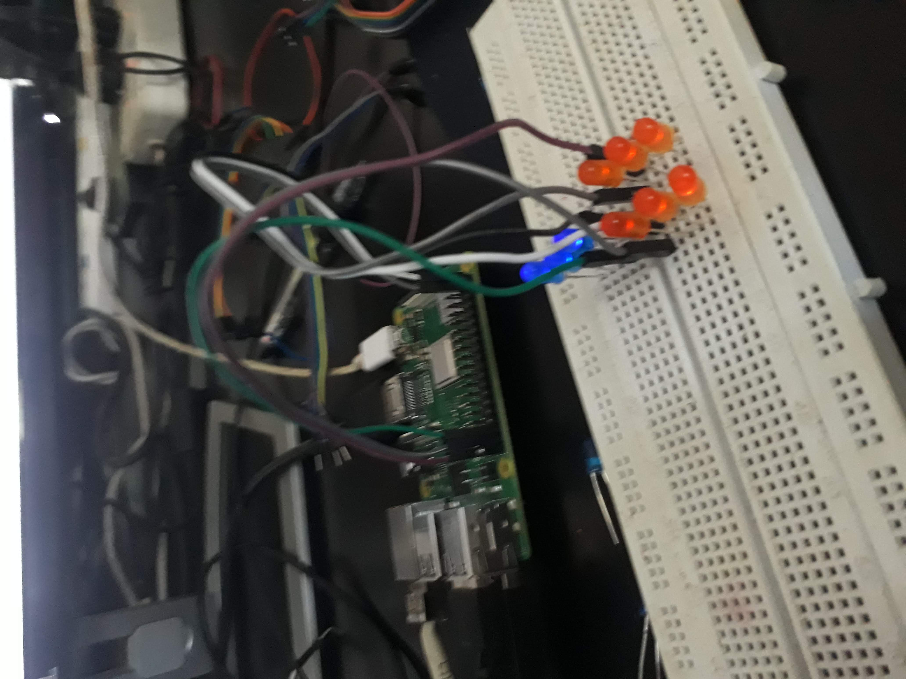
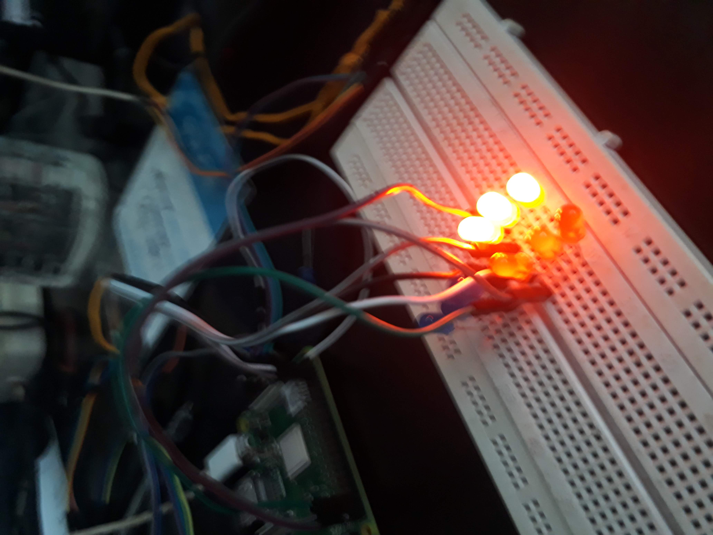

# AmbuLights

Raspberry Pi based project to notify vehicles about emergency ambulances in their route. It was developed during Hackathon organized by ITONICS Nepal. Whenever there is an emergency need of an ambulance the emergency lights in that particular route will be turned on.
## Images

**Hardware Device**

   

   

<!-- **Screenshot from UserApp**

   

 -->

## Components Used

1. Raspberry Pi 3 Model B
2. leds *9
3. Breadboard 

## Working

User selects a route from the map, the information about the route is sent to the server. The server will match the best route by comparing the latitude and longitude of the route with pre defined ones. Once the route is matched the server will light the leds in the route notifying the vehicles about the coming ambulance.